# Ophel 🚀

<p align="center">
  
</p>

<p align="center">
  <strong>✨ AI's Benefit, Within Reach ✨</strong><br/>
  <em>AI 之益，触手可及</em>
</p>

<p align="center">
  
  <a href="https://github.com/urzeye/ophel/stargazers"></a>
  <a href="https://opencollective.com/urzeye-oss"></a>
</p>

<p align="center">
  <a href="#-demo">Demo</a> •
  <a href="#-core-features">Core Features</a> •
  <a href="#%EF%B8%8F-architecture">Architecture</a> •
  <a href="#-quick-start">Quick Start</a> •
  <a href="#-support">Support</a>
</p>

---

👋 **Ophel** is the successor to `gemini-helper`, completely rewritten with a modern tech stack. It is available as both a **Browser Extension** and a **Userscript**, designed to enhance your AI experience across **Gemini**, **ChatGPT**, **Claude**, **Grok**, and **AI Studio**.

[👉 前往 GitHub 仓库查看项目源码与详细文档](https://github.com/urzeye/ophel)

---

## 📹 Demo

|                                                          Outline                                                           |                                                       Conversations                                                        |                                                          Features                                                          |
| :------------------------------------------------------------------------------------------------------------------------: | :------------------------------------------------------------------------------------------------------------------------: | :------------------------------------------------------------------------------------------------------------------------: |
| <video src="https://github.com/user-attachments/assets/a40eb655-295e-4f9c-b432-9313c9242c9d" width="280" controls></video> | <video src="https://github.com/user-attachments/assets/a249baeb-2e82-4677-847c-2ff584c3f56b" width="280" controls></video> | <video src="https://github.com/user-attachments/assets/6dfca20d-2f88-4844-b3bb-c48321100ff4" width="280" controls></video> |

## ✨ Core Features

- 🧠 **Smart Outline** — Auto-parse user queries & AI responses into navigable structure
- 💬 **Conversation Manager** — Folders, tags, search, batch operations
- ⌨️ **Prompt Library** — Variables, Markdown preview, categories, one-click insert
- 🎨 **Theme Customization** — 20+ dark/light themes, custom CSS
- 🔧 **UI Optimization** — Widescreen mode, page & bubble width control, sidebar layout
- 📖 **Reading Experience** — Scroll lock, reading history restore, Markdown fixes
- ⚡ **Productivity Tools** — Shortcuts, model lock, tab auto-rename, notifications
- 🎭 **Claude Enhancement** — Session Key management, multi-account switching
- 🔒 **Privacy First** — Local storage, WebDAV sync, no data collection

## 🏗️ Architecture

**Tech Stack**: [Plasmo](https://docs.plasmo.com/) + [React](https://react.dev/) + [TypeScript](https://www.typescriptlang.org/) + [Zustand](https://github.com/pmndrs/zustand)

<details>
<summary>📐 Architecture Diagram (click to expand)</summary>



</details>

```mermaid
%%{init: {'theme': 'base', 'themeVariables': { 'primaryColor': '#6366f1', 'primaryTextColor': '#fff', 'primaryBorderColor': '#4f46e5', 'lineColor': '#94a3b8', 'secondaryColor': '#f1f5f9', 'tertiaryColor': '#e2e8f0', 'background': '#ffffff'}}}%%
flowchart TB
    subgraph Platforms["🚀 Dual Platform Build"]
        direction LR
        EXT["🧩 Browser Extension<br/><small>Plasmo + Manifest V3</small>"]
        US["🛢️ Userscript<br/><small>Vite + vite-plugin-monkey</small>"]
    end

    subgraph Entry["📦 Entry Layer"]
        direction LR
        CE["Content Script<br/><small>ui-entry.tsx</small>"]
        BG["Background<br/><small>background.ts</small>"]
        OPT["Options Page<br/><small>tabs/options.tsx</small>"]
        USE["Userscript Entry<br/><small>platform/userscript/entry.tsx</small>"]
    end

    subgraph Adapters["🔌 Site Adapters"]
        direction LR
        GEM["Gemini"]
        GPT["ChatGPT"]
        CLA["Claude"]
        GRK["Grok"]
        AIS["AI Studio"]
        GEE["Gemini<br/>Enterprise"]
    end

    subgraph Core["⚙️ Core Modules"]
        direction TB
        TM["🎨 Theme Manager<br/><small>Theme Switch · View Transitions</small>"]
        OM["📑 Outline Manager<br/><small>Outline Generation · Navigation</small>"]
        RH["📖 Reading History<br/><small>Position Restore</small>"]
        ML["🔒 Model Lock<br/><small>Model Locking</small>"]
        NM["📡 Network Monitor<br/><small>Request Interception · Status Detection</small>"]
    end

    subgraph State["💾 State Management"]
        direction LR
        ZS["Zustand Stores<br/><small>settings · prompts · conversations</small>"]
        CS["Chrome Storage<br/><small>local · sync</small>"]
        GM["GM_* Storage<br/><small>Userscript API</small>"]
    end

    subgraph UI["🎯 UI Components"]
        direction TB
        APP["App.tsx"]
        MP["MainPanel<br/><small>Side Panel</small>"]
        SM["SettingsModal<br/><small>Settings Dialog</small>"]
        TABS["Tabs<br/><small>Outline · Conversations · Prompts</small>"]
    end

    subgraph CSS["🎨 Styling System"]
        direction LR
        SD["Shadow DOM<br/><small>Style Isolation</small>"]
        TV["CSS Variables<br/><small>Theme Variables</small>"]
        TH["Theme Presets<br/><small>20+ Preset Themes</small>"]
    end

    EXT --> CE & BG & OPT
    US --> USE
    CE --> Adapters
    USE --> Adapters
    Adapters --> Core
    Core --> State
    CE --> UI
    USE --> UI
    UI --> CSS
    ZS <--> CS
    ZS <-.-> GM

    classDef platform fill:#818cf8,stroke:#6366f1,color:#fff
    classDef entry fill:#34d399,stroke:#10b981,color:#fff
    classDef adapter fill:#fbbf24,stroke:#f59e0b,color:#1f2937
    classDef core fill:#60a5fa,stroke:#3b82f6,color:#fff
    classDef state fill:#f472b6,stroke:#ec4899,color:#fff
    classDef ui fill:#a78bfa,stroke:#8b5cf6,color:#fff
    classDef css fill:#fb923c,stroke:#f97316,color:#fff

    class EXT,US platform
    class CE,BG,OPT,USE entry
    class GEM,GPT,CLA,GRK,AIS,GEE adapter
    class TM,OM,RH,ML,NM core
    class ZS,CS,GM state
    class APP,MP,SM,TABS ui
    class SD,TV,TH css
```

## 🚀 Quick Start

> [!tip]
> **We highly recommend using the Browser Extension version** for a more complete feature set, better experience, and higher compatibility. The Userscript version has limitations (e.g., cannot read cookies, no independent popup).

### Web Store

[Chrome](https://chromewebstore.google.com/detail/ophel-ai-%E5%AF%B9%E8%AF%9D%E5%A2%9E%E5%BC%BA%E5%B7%A5%E5%85%B7/lpcohdfbomkgepfladogodgeoppclakd) | [Firefox](https://addons.mozilla.org/zh-CN/firefox/addon/ophel-ai-chat-enhancer) | [Greasy Fork](https://greasyfork.org/zh-CN/scripts/563646-ophel)

### Manual Installation

#### Browser Extension

1. Download & unzip from [Releases](https://github.com/urzeye/ophel/releases)
2. Open browser extensions page, enable **Developer mode**
3. Click **Load unpacked** and select the unzipped folder

#### Userscript

1. Install [Tampermonkey](https://www.tampermonkey.net/)
2. Download `.user.js` file from [Releases](https://github.com/urzeye/ophel/releases)
3. Drag into browser or click the link to install

### Local Build

<details>
<summary>Click to expand build steps</summary>

**Requirements**: Node.js >= 20.x, pnpm >= 10.x

```bash
git clone https://github.com/urzeye/ophel.git
cd ophel
pnpm install
pnpm dev              # Development mode
pnpm build            # Chrome/Edge production build
pnpm build:firefox    # Firefox production build
pnpm build:userscript # Userscript production build
```

**Tech Stack**: [Plasmo](https://docs.plasmo.com/) + [React](https://react.dev/) + [TypeScript](https://www.typescriptlang.org/) + [Zustand](https://github.com/pmndrs/zustand)

</details>

### Bug Report

For issues or suggestions, please visit [GitHub Issues](https://github.com/urzeye/ophel/issues).

## 💖 Support

<p align="center">
  <em>"If you want to go fast, go alone. If you want to go far, go together."</em>
</p>

<p align="center">
  If Ophel helps you, consider supporting:<br/><br/>
  <a href="https://opencollective.com/urzeye-oss">
    
  </a>
</p>

<p align="center">
  Made with ❤️ by <a href="https://github.com/urzeye">urzeye</a>
</p>
